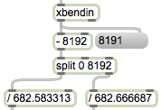
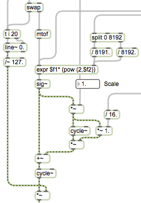
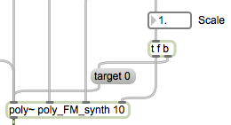

###Max/MSP Seaboard Tutorials

####Introduction

This folder contains seven [Max/MSP](www.cycling74.com/products/max/) patches that explain how  Seaboard MIDI data works, how it can be parsed in Max/MSP and how to use it to control a synthesiser or external application. This includes demonstrations of the Seaboard's unqiue polyphonic pitch bend and aftertouch, and how to output Seaboard data to external applications with using the [Open Sound Control](https://en.wikipedia.org/wiki/Open_Sound_Control) (OSC) protocol.

Before opening a patch, please power up and connect your Seaboard using the power switch on the Back Panel (the Seaboard takes around 15 seconds to launch; the SoundDial will settle once launch is completed). Each patch opens in Presentation Mode, and is fully interactive – just start playing the Seaboard. To start hacking, enter Edit Mode to reveal the patching structure.

Each patch is annotated with comments, so if you are already familiar with Max then they may be sufficient to get you hacking. The comments document how and why each object was used, and will help you create your own Seaboard patches. If you're new to Max, the below articles should be helpful. Happy hacking!

####Table of Contents

Tutorial 1 - [Seaboard MIDI Data]()

Tutorial 2 - [Parsing Seaboard MIDI Data]()

Tutorial 3 - [Mono Sine Synth]()

Tutorial 4 - [Poly Sine Synth]()

Tutorial 5 - [Mono FM Synth]()

Tutorial 6 - [Poly FM Synth]()

Tutorial 7- [Open Sound Control (OSC) Output]()

####Tutorial 1: Seaboard MIDI Data
 
This patch shows how to select the Seaboard as a MIDI input device and how to input MIDI data from it into a Max patch using the ‘midiparse' object. This object will allow to input MIDI pitch and velocity data, polyphonic aftertouch and the MIDI channel being used. 
#
Instead of using the  ‘midiparse’ object for Pitch Bend, the ‘xbendin’ object is used to be able to easily input 14 bit Pitch Bend from the Seaboard. 
#
From this patch it can be seen that Polyphonic aftertouch is inputted my the continuous pressure put on each note played. Pitch Bend is applied to the bend of notes on the X-axis and then sliding of notes with the use of the Glissando Ribbon at the top and the bottom of the Seaboard. If you perform a Pitch Bend on one of the ribbons, you will notice that the14-bit pitch bend applies to a range of +/- 1 octaves.

####Tutorial 2: Parsing Seaboard MIDI Data

This patch shows how the data from the Seaboard can be split into individual channels for each note played. By playing multi notes it can be seen that Aftertouch and Pitch Bend are polyphonic and apply individually for each note. To achieve this you can see that each note played is on a different MIDI channel, using up to 10 channels. 

####Tutorial 3: Mono Sine Synth

This patch shows how a simple monophonic sine synthesiser being controlled be the Seaboard, can be created in Max. To trigger notes on and off, the velocity of each note determines the amplitude of the signal and a note off message of a velocity value of 0, mutes the signal. To avoid any clicks when a note is released, a ‘line~’ object is added to ramp down the velocity to 0 over 20ms. In a more advanced synth patch, this could be replaced with an amplitude envelope that would give more control over the the amplitude of a note while it is played and when it is released.
#

Continuous Aftertouch is applied to the amplitude of each note, varying the level of a note played, after the initial velocity value. 

Pitch Bend is then applied to vary the frequency of the Oscillator by +/- 1 Octave. This is achieved by compressing the 14-bit pitch  bend from -8192 to +8191 to -1 to +1. The formula of; 

base frequency x 2^(pitch bend)

is then used so that it will double the base frequency for a +1 octave pitch bend and half the frequency for a -1 octave pitch bend.

####Tutorial 4: Poly Sine Synth

The simple sine synth created in the previous patch is now encapsulated into a ‘poly~’ object to allow multiple instance of the patch to be used simultaneously, introducing polyphony. As the Seaboard uses up to 10 MIDI channels, 10 voices/ instances of the original sine synth are created. 
#

To also create polyphonic Aftertouch and Pitch Bend, each voice/ instance needs to input note data, aftertouch and pitch bend for a specific MIDI channel. For instance, pitch bend, aftertouch and note data on MIDI channel 1 will only go to the first voice/ instance of the Sine_synth patch. To achieve this, the message ‘target $1’ is sent to the first inlet of the ‘poly~’ object, where $1 will be replaced by the current MIDI channel data is being sent on.

####Tutorial 5: Mono FM Synth

This patch shows how a simple monophonic FM (Frequency Modulation) synthesiser controlled by the Seaboard, can be created in Max. 
#

As before with the sine wave synth, pitch bend is set to modulate the pitch of the oscillator by +/- 1 octave. Aftertouch however is no longer assigned to the amplitude of the note played but instead, controls the Modulation Depth of the Modulating frequency. This changes the timbre of the sound created, and works well at creating a pseudo frequency cut-off, where adding more pressure opens up the filter further. 

There is also control over the Harmonic ratio, or the Scale between the Carrier and Modulation frequency. Having the value of the scale as an integer value will create a consonant sound, while having the value in-between integers will create more of a dissonant sound.

####Tutorial 6: Poly FM Synth

The FM patch created in the previous tutorial is now encapsulated into a ‘poly~’ object similar to Tutorial 4, creating a 10 voice Polyphonic FM Synthesiser, with full polyphonic Aftertouch and Pitch Bend from the Seaboard.

The difference with this patch is that there is an extra parameter added that controls the Scale between the Carrier and Modulating frequency. As this is a parameter that is local to all instances, every time this value changes, a message of ‘target 0’ needs to be sent to the left inlet of the poly~ object to update all instances. If this is not there then, it will only update the current instance being used.
#
This is something to consider when designing your own polyphonic synths, as this is needed if you want to have control of parameters over all instances, such as envelopes or oscillator types.

####Tutorial 7: Open Sound Control (OSC) Output

This patch shows how the ‘udpsend’ object can be used to output any data from Max to external applications with the use of Open Sound Control (OSC). When using OSC, the IP address of the receiving application or device needs to be set, as well as the port it is going to be send to. This can be manually updated in this patch using the text boxes provided.
#
